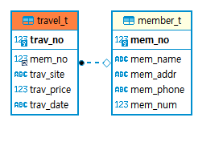
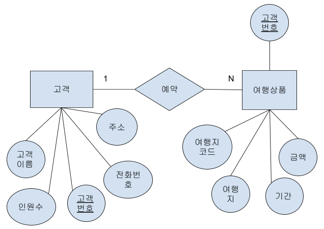

<h1> Travel Reservation<h1>
<h2>1. 여행예약관리 시스템 주제 및 소개</h2>
  <h3>1.1 주제 </h3>
  Python과 데이터베이스를 연결하여 여행사 예약관리 시스템 구현
	<h3>1.2 조원 소개 </h3>
	
 이윤서, 라윤태, 최창민 

  <h2>2. 데이터 베이스</h2>
  <h3>2.1 데이터베이스 함수 지정</h3>
      <table 
            border ="1"
            width="50%"
            height="200">
            <caption><strong>Function Description</strong></caption>
        		<thead>
                <tr align="center" bgcolor="white">
                    <th>함수명</th>
                    <th>함수의 기능 소개</th>
                    <th>인수</th>
										<th>반환값</th>
                </tr>
						</thead>
            <tbody>
                <tr align="center" bgcolor="white">
                    <th>check_member</th>
                    <td>고객테이블에 등록된 회원인지 검사하는 함수</td>
                    <td>name,number</td>
                    <td>True/False</td>
                </tr>
                <tr align="center" bgcolor="white">
                    <th>add_member</th>
                    <td>신규 고객 입력(여행예약자)
1.check_member로 고객테이블에 고객정보 유무 확인
2. 나머지 정보를 입력받아 고객테이블에 저장:
인원수, 고객번호, 주소
</td>
                    <td>name,number</td>
                    <td>True/False</td>
                </tr>
								<tr align="center" bgcolor="white">
                    <th>update_member</th>
                    <td>기존 고객 정보 수정</td>
                    <td>show_member</td>
                    <td>True/False</td>
                </tr>
								<tr align="center" bgcolor="white">
                    <th>delete_member</th>
                    <td>고객 정보 삭제</td>
                    <td>show_member</td>
                    <td>True/False</td>
                </tr>
								<tr align="center" bgcolor="white">
                    <th>add_travel</th>
                    <td>고객이 택한 여행상품 테이블에 저장</td>
                    <td></td>
                    <td>True/False</td>
                </tr>
								<tr align="center" bgcolor="white">
                    <th>show_travel</th>
                    <td>전체 고객 정보 조회</td>
                    <td></td>
                    <td></td>
                </tr>
							<tr align="center" bgcolor="white">
                    <th>show_travelmember</th>
                    <td>여행예약고객 목록 조회 </td>
                    <td></td>
                    <td></td>
                </tr>
            </tbody>
        </table>
				<h3>2.2 데이터베이스 </h3>
				<ol>
					<li><strong>고객(member) : </strong>고객번호(mem_no), 고객이름(mem_name), 주소(mem_addr), 전화번호(mem_phone), 인원수(mem_num)</li>
					<li><strong>여행상품(travel) : </strong>여행지코드(trav_no), 여행지(trav_site), 금액(trav_price), 여행기간(trav_period)</li>
				</ol>
				<h3>2.3 여행 예약 관리 데이터베이스 구조 </h3>
				<table 
            border ="1"
            width="50%"
            height="200">
            <caption><strong>고객 테이블(member_t)</strong></caption>
        		<thead>
                <tr align="center" bgcolor="white">
                    <th>속성이름</th>
                    <th>데이터타입</th>
                    <th>NOT NUll</th>
										<th>기본키</th>
										<th>조건</th>
                </tr>
						</thead>
            <tbody>
                <tr align="center" bgcolor="white">
                    <th>고객 번호(mem_no)</th>
                    <td>unsigned int</td>
                    <td>O</td>
                    <td>primary key</td>
										<td>auto_increasement</td>
                </tr>
                <tr align="center" bgcolor="white">
                    <th>고객 이름(mem_name)</th>
                    <td>varchar(20)</td>
                    <td>O</td>
                    <td></td>
										<td></td>
									<tr align="center" bgcolor="white">
                    <th>주소(mem_addr)</th>
                    <td>varchar(20)</td>
                    <td>O</td>
                    <td></td>
										<td></td>
									<tr align="center" bgcolor="white">
                    <th>전화번호(mem_phone)</th>
                    <td>varchar(20)</td>
                    <td>O</td>
                    <td></td>
										<td></td>
									<tr align="center" bgcolor="white">
                    <th>총 인원 수 (mem_num)</th>
                    <td>unsigned int</td>
                    <td></td>
                    <td></td>
										<td></td>
                </tr>
            </tbody>
        </table>
		<table 
            border ="1"
            width="50%"
            height="200">
            <caption><strong>여행상품 테이블 (travel_t)</strong></caption>
        		<thead>
                <tr align="center" bgcolor="white">
                    <th>속성이름</th>
                    <th>데이터타입</th>
                    <th>NOT NUll</th>
										<th>기본키</th>
										<th>조건</th>
                </tr>
						</thead>
            <tbody>
                <tr align="center" bgcolor="white">
                    <th>고객 번호(mem_no)</th>
                    <td>unsigned int</td>
                    <td>O</td>
                    <td>foreign key</td>
										<td></td>
                </tr>
                <tr align="center" bgcolor="white">
                    <th>여행지 코드(trav_no)</th>
                    <td>unsigned int<</td>
                    <td>O</td>
                    <td></td>
										<td></td>
									<tr align="center" bgcolor="white">
                    <th>여행지(trav_site)</th>
                    <td>varchar(20)</td>
                    <td>O</td>
                    <td>primary key</td>
										<td></td>
									<tr align="center" bgcolor="white">
                    <th>금액(trav_price)</th>
                    <td>unsigned int</td>
                    <td>O</td>
                    <td></td>
										<td></td>
									<tr align="center" bgcolor="white">
                    <th>여행기간(trav_date)</th>
                    <td>varchar(20)</td>
                    <td>O</td>
                    <td></td>
										<td></td>
                </tr>
            </tbody>
        </table>
	<h3>2.4 ERD Diagram </h3>
	
	
<h2>3. 실행결과 </h3>
